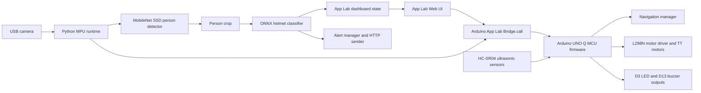
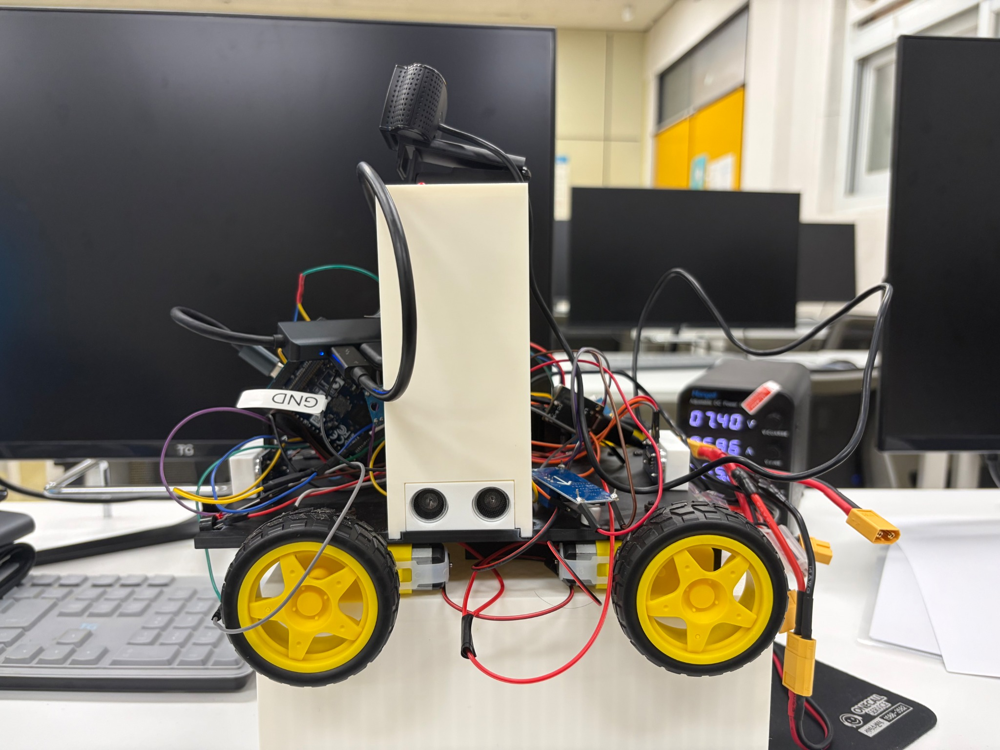
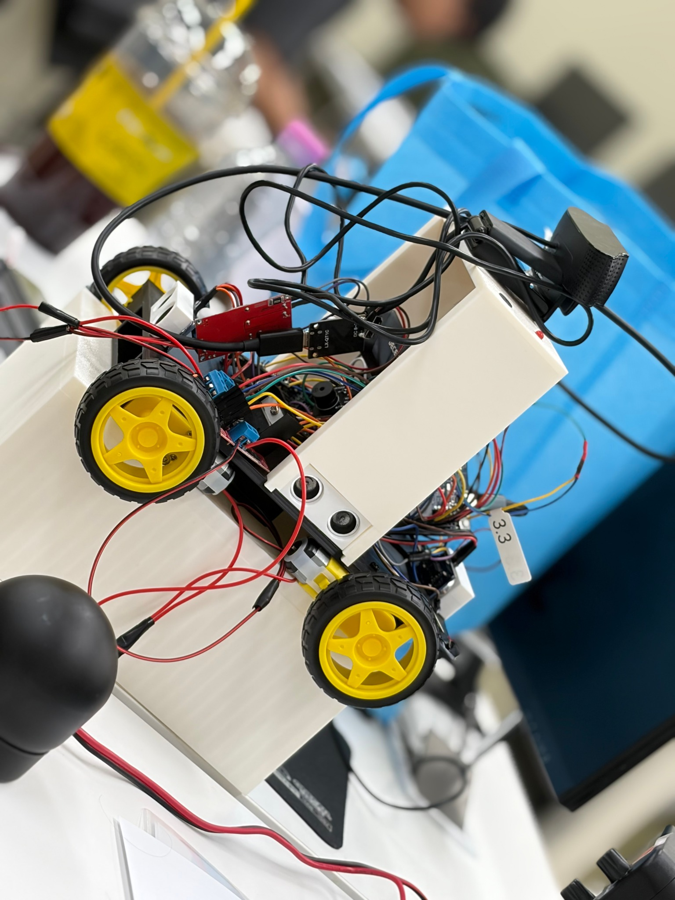
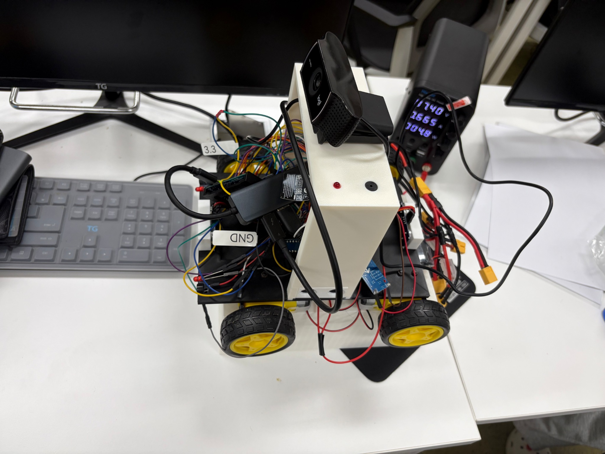
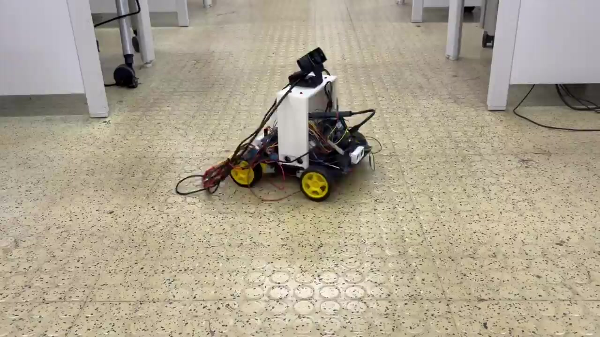
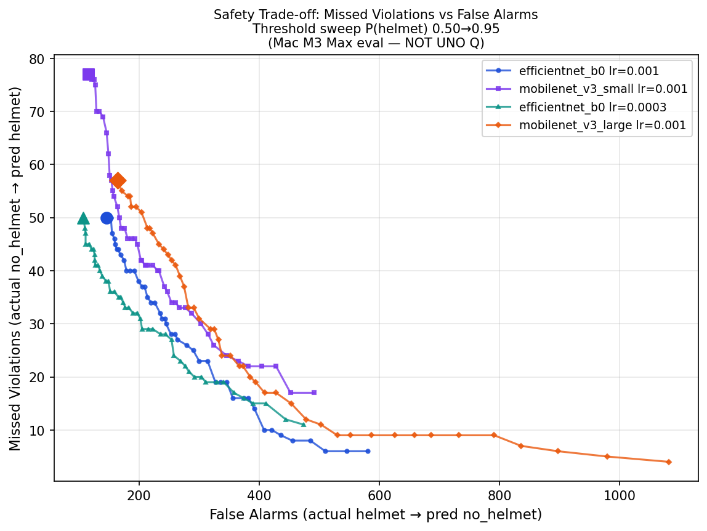
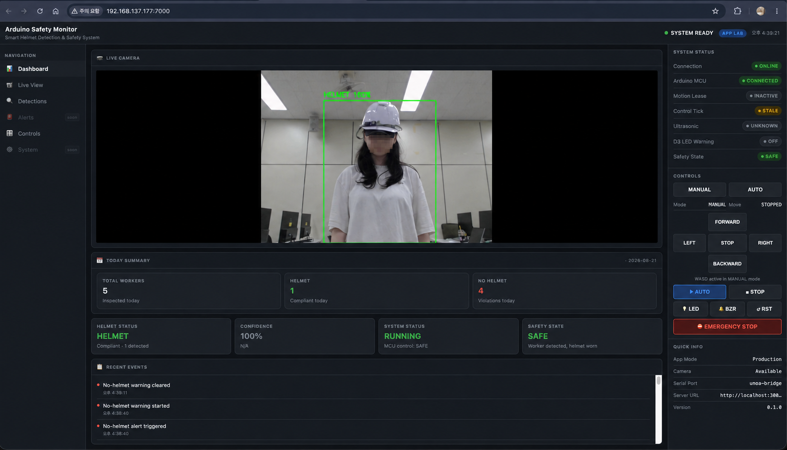
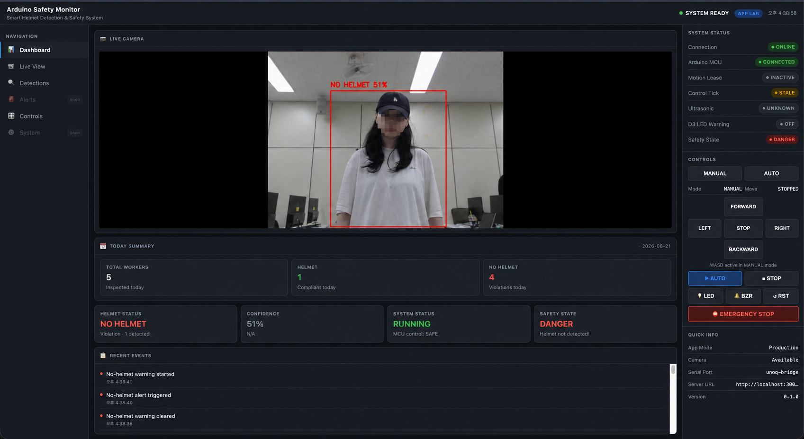

# Invent the Future with Arduino UNO Q and App Lab: Mobile Safety Monitoring Robot

A mobile Arduino UNO Q robot that combines autonomous obstacle avoidance with App Lab helmet-compliance monitoring.

## Project Overview

This project was built for the "Invent the Future with Arduino UNO Q and App Lab" competition. It explores a mobile safety-monitoring robot that can patrol a workspace, avoid nearby obstacles, detect people with a camera, classify whether a detected person is wearing a safety helmet, and show the system state in an Arduino App Lab dashboard.

The repository contains Arduino MCU firmware, a Python MPU runtime, an App Lab dashboard package generator, AI training and evaluation code, model artifacts, tests, wiring documentation, robot photographs, and demonstration media.

This is an independently developed project. Hardware details that have not yet been confirmed are marked instead of being guessed.

## Problem Statement

Fixed safety cameras only observe selected areas. A mobile robot can inspect additional viewpoints while carrying its own camera, obstacle sensors, and local control logic. This prototype combines autonomous navigation with helmet-compliance monitoring.

This project is a functional prototype and is not an industrially certified safety device.

## Project Goals

- Build a physical Arduino UNO Q robot platform.
- Keep MCU responsibilities focused on motor control, ultrasonic sensing, motion authorization, and local warning outputs.
- Keep MPU responsibilities focused on camera input, AI inference, dashboard state, App Lab integration, and alert transmission.
- Use Arduino App Lab Bridge IPC for MCU-MPU commands.
- Detect people, crop each person, and classify helmet status.
- Provide clear dashboard evidence for helmet and no-helmet states.
- Stop or restrict motion on communication loss, stale motion lease, manual-hold timeout, and explicit reset.

## Key Features

| Feature | Evidence | Status |
|---|---|---|
| App Lab Bridge RPC communication | `mpu/bridge_rpc.py`, `arduino/arduino.ino`, `arduino/comm.h` | Implemented in code |
| MCU motor control through L298N | `arduino/motor.h`, `arduino/pins.h` | Implemented in firmware |
| Four HC-SR04 ultrasonic sensors | `arduino/ultrasonic.h`, `arduino/pins.h` | Implemented in firmware |
| Autonomous obstacle-avoidance state machine | `arduino/navigation.h`, `arduino/robot_controller.h` | Implemented and demonstrated separately |
| Helmet/no-helmet AI pipeline | `mpu/main.py`, `mpu/detector.py`, `mpu/classifier.py` | Implemented in Python runtime |
| App Lab dashboard | `app_lab/ui/assets/index.html`, `app_lab/generate_app_lab.py` | Implemented and packaged |
| Dashboard statistics and event log | `mpu/dashboard_state.py`, dashboard screenshots | Implemented in software |
| LED warning output on D3 | `arduino/pins.h`, `arduino/comm.h` | Implemented in firmware |
| Buzzer diagnostic output on D13 | `arduino/pins.h`, `arduino/comm.h` | Implemented in firmware |

## Innovation and Differentiation

The project combines mobile monitoring and personal protective equipment detection in one small prototype. Instead of relying only on fixed cameras, the robot can move through a space while the MPU performs person detection and helmet classification.

The MCU remains responsible for time-sensitive motion, sensor processing, and safety behaviour, while the MPU handles AI inference, dashboard state, camera processing, and alert logic.

The communication design separates general connectivity from motion authorization. A connectivity check alone does not authorize continued movement. Motion authority is maintained through control and manual-hold updates, reducing the risk of stale commands continuing after communication problems.

## System Architecture



The active MCU-MPU communication path is Arduino UNO Q App Lab Bridge IPC using named RPC endpoints such as:

- `asm_motor`
- `asm_mode`
- `asm_status`
- `asm_safe_reset`

The current implementation does not use raw USB Serial JSON-RPC as its production transport.

## End-to-End Operation Flow

1. The App Lab package starts the Python adapter generated by `app_lab/generate_app_lab.py`.
2. The adapter validates the runtime model files and starts `HelmetDetectionSystem`.
3. The Python runtime opens the camera and connects to the MCU through `Bridge.call`.
4. Each camera frame is processed by `PersonDetector`.
5. Each detected person is cropped and passed to `HelmetClassifier`.
6. The dashboard state is updated with worker presence, helmet result, confidence, statistics, and recent events.
7. For a no-helmet incident, the alert manager can request the MCU warning output and send an HTTP alert.
8. The dashboard polls `/api/state` and `/api/frame` to display the live system state and camera frame.
9. The MCU executes autonomous or manual motor behaviour and reports status through `asm_status`.
10. `safe_reset`, motion lease timeout, manual-hold timeout, and communication timeout stop or restrict movement.

## Implementation Status

| Area | Status | Notes |
|---|---|---|
| Physical robot | Built | Supported by robot photographs |
| Circuit diagram | Documented | `docs/images/circuit-image.svg` |
| MCU firmware | Implemented | Arduino RouterBridge/RPClite endpoints are registered |
| Python MPU runtime | Implemented | Integrates the camera, detector, classifier, Bridge, sender, and dashboard |
| App Lab dashboard | Implemented | HTML/CSS/JavaScript dashboard and generated package included |
| Autonomous navigation | Implemented | Demonstrated in a separate video |
| Helmet dashboard state | Implemented | Demonstrated through dashboard screenshots |
| LED and buzzer outputs | Firmware implemented | Physical verification evidence is limited |
| Continuous end-to-end demonstration | Not documented | Navigation and helmet monitoring were demonstrated separately |

## Hardware Overview

The robot uses a four-wheel chassis with an Arduino UNO Q, L298N motor driver, four TT geared motors, four HC-SR04 ultrasonic sensors, a Logitech C922 Pro HD Stream Webcam, and custom 3D-printed mechanical parts.

The power system uses a TERANTY 2S LiPo battery, an XL6009 DC-DC boost converter configured to 18 V, an Aideepen USB-C PD output module, and a DSEOM USB-C 7-in-1 multi-hub.

The Arduino UNO Q and Logitech C922 camera are connected through the USB-C hub.



The front photograph shows the completed robot with the front ultrasonic sensor assembly and upper electronics area.



The angled photograph shows the chassis, wheels, wiring, controller area, and camera mount.



The top photograph shows the controller and wiring arrangement.



The frame photograph shows the custom base structure before the final upper assembly was installed.

## Complete Hardware BOM

| Component | Model or Specification | Quantity | Purpose | Status |
|---|---|---:|---|---|
| Controller board | Arduino UNO Q | 1 | MCU firmware, App Lab Bridge, and robot control | Implemented |
| Motor driver | L298N dual H-bridge | 1 | Controls the left and right motor groups | Implemented |
| DC geared motors | TT geared motor | 4 | Four-wheel drive | Implemented |
| Wheels | TT motor-compatible wheel | 4 | Robot locomotion | Implemented |
| Ultrasonic sensors | HC-SR04 | 4 | Front, rear, left, and right obstacle sensing | Implemented |
| Camera | Logitech C922 Pro HD Stream Webcam | 1 | Person detection and helmet classification | Implemented |
| Logic-level shifter | TXS0108E | 1 | 5 V and 3.3 V logic-level conversion | Implemented |
| Battery | TERANTY 2S LiPo, 7.4 V nominal, 2,200 mAh, 50C, XT60 | 1 | Main robot power source | Implemented |
| Boost converter | XL6009 adjustable DC-DC boost converter | 1 | Raises the battery voltage to 18 V | Implemented |
| USB-C PD output module | Aideepen 45 W model, DC 8–30 V input, PD/QC3.0/SCP/PPS | 1 | Generates USB-C PD output from the boosted supply | Implemented |
| USB-C multiport hub | DSEOM USB-C 7-in-1 multi-hub | 1 | Connects and powers the Arduino UNO Q and USB camera | Implemented |
| Alert LED | Red LED connected to D3 | 1 | Local visual warning | Firmware implemented |
| Buzzer | Buzzer connected to D13 | 1 | Local audible warning or diagnostic output | Firmware implemented |
| Jumper wires and connectors | Signal and power wiring | 1 set | Electrical connections | Implemented |
| M3 × 8 mm bolts | M3, 8 mm length | 8 | Component and bracket fastening | Implemented |
| M3 × 25 mm bolts | M3, 25 mm length | 8 | Chassis and structural fastening | Implemented |
| M3 nuts | Standard M3 nuts | 16 | Fastens the M3 bolts | Implemented |
| Custom 3D-printed parts | Chassis, base plate, sensor mounts, camera mount, and electronics mounts | 1 set | Mechanical structure and component mounting | Designed by Dongju Lee |
| TT motor brackets | [TT Gear Motor Mount](https://makerworld.com/en/models/519327-tt-gear-motor-mount) by [Chief human](https://makerworld.com/en/@Chief_human) | 4 | Mounts the four TT motors | Used with creator permission and licensed under [CC BY 4.0](https://creativecommons.org/licenses/by/4.0/) |

## Software and Development Tools

| Tool or Library | Evidence | Purpose |
|---|---|---|
| Arduino and C++ | `arduino/*.ino`, `arduino/*.h` | MCU firmware |
| Arduino App Lab | `app_lab/generate_app_lab.py`, generated App Lab package | Packaging and dashboard runtime |
| Python | `mpu/*.py`, `mpu/ai/*.py` | MPU runtime, AI training, and tests |
| JavaScript, HTML, and CSS | `app_lab/ui/assets/index.html` | Dashboard UI |
| OpenCV | `requirements.txt`, `mpu/camera.py`, `mpu/detector.py` | Camera capture and image processing |
| ONNX Runtime | `requirements.txt`, `mpu/detector.py`, `mpu/classifier.py` | Runtime AI inference |
| PyTorch and torchvision | `requirements.txt`, `mpu/ai/train.py` | AI model training |
| ONNX | `requirements.txt`, `mpu/ai/convert.py` | Model conversion and validation |
| Pillow | `requirements.txt`, `mpu/classifier.py` | Image preprocessing |
| requests | `requirements.txt`, `mpu/sender.py` | HTTP alert transmission |
| unittest and pytest-compatible tests | `mpu/tests/`, `tests/`, `setup.cfg` | Automated software testing |
| 3D modelling tools | `models/*.stl`, `models/*.3mf` | Mechanical design assets |

## Circuit Diagram and Power Architecture


The circuit diagram documents the Arduino UNO Q, L298N motor driver, four HC-SR04 sensors, D3 LED output, and D13 buzzer output.

The verified system power flow is:

```text
TERANTY 2S LiPo Battery
7.4 V nominal / 2,200 mAh / 50C / XT60
              |
              v
XL6009 DC-DC Boost Converter
Output configured to 18 V
              |
              v
Aideepen 45 W USB-C PD Output Module
              |
              v
DSEOM USB-C 7-in-1 Multi-hub
              |
              +-- Arduino UNO Q
              |
              `-- Logitech C922 Pro HD Stream Webcam
```

The XL6009 is used only as a DC-DC boost converter. USB Power Delivery output is handled by the separate Aideepen USB-C PD module.

The 18 V value applies to the XL6009 output supplied to the USB-C PD module. It does not mean that every downstream device directly receives 18 V. The USB-C PD module and connected devices negotiate or regulate their downstream voltage.

The Aideepen module supports up to 45 W, but this does not mean that the complete system continuously supplies 45 W. Actual available power is limited by the XL6009 converter, battery voltage, wiring, thermal conditions, and negotiated USB-C PD profile.

### Electrical Notes

- L298N ENA and ENB are driven by PWM pins D5 and D6.
- L298N direction pins use D2, D4, D7, and D8.
- Four HC-SR04 sensors use D9/D10, D11/D12, A0/A1, and A2/A3.
- The Arduino UNO Q, L298N, battery circuit, and sensors must use a common ground.
- HC-SR04 sensors are powered through the 5 V bus.
- The XL6009 output must be measured before downstream devices are connected.

### Software Safety Behaviour

- The MCU stops motion when the motion lease expires.
- The MCU switches to manual mode and queues a stop when `safe_reset` is executed.
- Missing or stale ultrasonic readings are treated as blocked.
- Manual movement requires continuing hold or lease refreshes.
- Communication loss prevents stale motion commands from continuing indefinitely.

## Pin Map

| Function | Arduino Pin | Firmware Constant |
|---|---|---|
| L298N ENA, left PWM | D5 | `MOTOR_LEFT_ENABLE_PIN` |
| L298N IN1, left direction A | D2 | `MOTOR_LEFT_IN1_PIN` |
| L298N IN2, left direction B | D4 | `MOTOR_LEFT_IN2_PIN` |
| L298N ENB, right PWM | D6 | `MOTOR_RIGHT_ENABLE_PIN` |
| L298N IN3, right direction A | D7 | `MOTOR_RIGHT_IN1_PIN` |
| L298N IN4, right direction B | D8 | `MOTOR_RIGHT_IN2_PIN` |
| Alert LED | D3 | `ALERT_LED_PIN` |
| Buzzer diagnostic output | D13 | `BUZZER_DIAG_PIN` |
| Front HC-SR04 trigger | D9 | `ULTRASONIC_FRONT_TRIGGER_PIN` |
| Front HC-SR04 echo | D10 | `ULTRASONIC_FRONT_ECHO_PIN` |
| Rear HC-SR04 trigger | D11 | `ULTRASONIC_REAR_TRIGGER_PIN` |
| Rear HC-SR04 echo | D12 | `ULTRASONIC_REAR_ECHO_PIN` |
| Left HC-SR04 trigger | A0 | `ULTRASONIC_LEFT_TRIGGER_PIN` |
| Left HC-SR04 echo | A1 | `ULTRASONIC_LEFT_ECHO_PIN` |
| Right HC-SR04 trigger | A2 | `ULTRASONIC_RIGHT_TRIGGER_PIN` |
| Right HC-SR04 echo | A3 | `ULTRASONIC_RIGHT_ECHO_PIN` |

The following pins are reserved by `arduino/pins.h`:

| Pin | Purpose |
|---|---|
| D0 | UART RX |
| D1 | UART TX |
| A4 | I2C SDA |
| A5 | I2C SCL |

## Hardware Assembly Guide

1. Print or prepare the custom chassis components from the files in `models/`.
2. Print four TT motor brackets using the credited third-party model.
3. Mount the four TT geared motors using the TT motor brackets.
4. Attach the four wheels to the motors.
5. Assemble the structural components using the M3 bolts and nuts.
6. Mount the Arduino UNO Q and L298N motor driver.
7. Install the four HC-SR04 sensors for front, rear, left, and right coverage.
8. Mount the Logitech C922 camera.
9. Wire the L298N motor driver according to the pin map.
10. Connect the TERANTY 2S LiPo battery to the XL6009 input.
11. Disconnect the Arduino UNO Q, USB-C hub, camera, and PD module before adjusting the XL6009.
12. Adjust the XL6009 output and confirm 18 V using a multimeter.
13. Connect the XL6009 output to the Aideepen USB-C PD module.
14. Connect the Aideepen module to the DSEOM multi-hub PD input.
15. Connect the Arduino UNO Q and Logitech C922 camera to the DSEOM hub.
16. Verify polarity, common ground, converter output, and motor/logic power separation.
17. Connect power only after completing all electrical checks.

Do not execute motor or diagnostic commands until the robot is physically supported, the wheels are clear, and the power wiring has been checked.

## AI Pipeline

The runtime AI flow is:

1. `CameraCapture` captures a BGR frame from camera index `0`.
2. `PersonDetector` loads `mpu/ai/models/ssd_mobilenet_v1_12.onnx`.
3. The detector filters COCO class ID `1` for person detections with a confidence of at least `0.5`.
4. `HelmetDetectionSystem.crop_person()` crops each detected person.
5. `HelmetClassifier` loads `mpu/ai/models/best_model.onnx`.
6. The classifier resizes each crop to `224 × 224`.
7. ImageNet normalization is applied.
8. ONNX Runtime performs helmet classification.
9. Output index `0` represents `no_helmet`.
10. Output index `1` represents `helmet`.
11. The runtime predicts `helmet` only when `P(helmet) >= 0.83`.
12. The dashboard receives the result, confidence, bounding box, statistics, and event updates.

The training loader uses per-object crops from annotated source images. This matches the runtime classifier input more closely than full-frame training.

## Datasets and Data Preparation

The training code uses the SHEL5K dataset path configured in `mpu/config.py`:

```text
~/AIdatasets/helmet-safety-robot/raw/9rcv8mm682-4/Safety Helmet Wearing Dataset
```

The expected dataset structure is:

```text
Safety Helmet Wearing Dataset/
+-- Annotations/
`-- Images/
```

The following Pascal VOC object labels are used:

| Annotation Label | Class Index | Runtime Class |
|---|---:|---|
| `person_no_helmet` | 0 | `no_helmet` |
| `person_with_helmet` | 1 | `helmet` |

Head-only and helmet-only labels are excluded because they do not match the runtime whole-person crop contract.

SHWD is present in configuration as `SHWD_PATH`, but it is excluded from the current baseline training process.

## Training Process

Run the training process with:

```bash
python -m mpu.ai.train \
  --architecture efficientnet_b0 \
  --epochs 30 \
  --batch-size 32 \
  --lr 0.001 \
  --seed 42 \
  --patience 5 \
  --train-ratio 0.8 \
  --output-dir mpu/ai/runs
```

Training artifacts are written under:

```text
mpu/ai/runs/<run_id>/
```

The training script protects production model files in `mpu/ai/models/` from being overwritten.

Supported classifier architectures:

- EfficientNet-B0
- MobileNetV3-Small
- MobileNetV3-Large

Training uses:

- ImageNet pretrained weights
- Adam optimizer
- Weighted `CrossEntropyLoss`
- Source-image-grouped train/validation splitting
- Early stopping based on validation loss
- Fixed random seed for reproducibility

## Model Comparison and Selection

The repository includes comparison artifacts under:

```text
mpu/ai/comparisons/four_model_comparison/
```

The selected production candidate is:

```text
20260820_204342_efficientnet_b0
```

This model uses EfficientNet-B0 with a learning rate of `0.0003`.

| Run | Architecture | Learning Rate | Validation Accuracy | Macro F1 | No-Helmet Recall | Missed Violations | False Alarms | ONNX Size |
|---|---|---:|---:|---:|---:|---:|---:|---:|
| `20260820_171048_efficientnet_b0` | EfficientNet-B0 | 0.001 | 93.6136% | 0.9177 | 0.9342 | 50 | 146 | 15.978 MB |
| `20260820_193048_mobilenet_v3_small` | MobileNetV3-Small | 0.001 | 93.7113% | 0.9170 | 0.8987 | 77 | 116 | 6.157 MB |
| `20260820_204342_efficientnet_b0` | EfficientNet-B0 | 0.0003 | 94.8843% | 0.9330 | 0.9342 | 50 | 107 | 15.978 MB |
| `20260820_210239_mobilenet_v3_large` | MobileNetV3-Large | 0.001 | 92.7990% | 0.9076 | 0.9250 | 57 | 164 | 16.399 MB |

These values are validation-set metrics from repository artifacts. They do not prove real-world industrial performance.

## Model Evaluation and Threshold Selection



The threshold graph compares missed violations and false alarms for `P(helmet)` thresholds from `0.50` to `0.95`.

The evaluation was performed on a MacBook Pro with an M3 Max. It is not an Arduino UNO Q inference-latency benchmark.

The runtime threshold is configured in `mpu/config.py`:

```python
HELMET_ACCEPTANCE_THRESHOLD = 0.83
```

For `20260820_204342_efficientnet_b0`, the threshold sweep records:

- Threshold: `0.83`
- No-helmet recall: at least `97%`
- Missed violations: `22`
- False alarms: `277`
- Evaluation samples: `3,069`
- PyTorch/ONNX decision disagreements: `0`

## Installation

Clone the repository:

```bash
git clone https://github.com/DongjuLee0528/arduino-safety-monitor.git
cd arduino-safety-monitor
```

Create and activate a Python virtual environment:

```bash
python -m venv .venv
source .venv/bin/activate
```

Install the required packages:

```bash
python -m pip install -r requirements.txt
```

Generate the Arduino App Lab package:

```bash
python app_lab/generate_app_lab.py
```

This creates or refreshes:

```text
app_lab/Arduino Safety Monitor/
```

The package is generated from the authoritative `mpu/`, `arduino/`, and `app_lab/ui/assets/` sources.

## Configuration

| File | Purpose |
|---|---|
| `arduino/config.h` | Motor speeds, sensor thresholds, timing, motion lease, command timeout, and buzzer timing |
| `arduino/pins.h` | MCU pin assignments |
| `mpu/config.py` | Dataset paths, model paths, camera settings, thresholds, server URL, and App Lab development mode |
| `app_lab/requirements_app_lab.txt` | App Lab Python runtime dependencies |
| `app_lab/Arduino Safety Monitor/app.yaml` | Generated App Lab application configuration |
| `app_lab/Arduino Safety Monitor/sketch/sketch.yaml` | Generated sketch profile |

The following runtime model files are required:

```text
mpu/ai/models/ssd_mobilenet_v1_12.onnx
mpu/ai/models/best_model.onnx
mpu/ai/models/best_model.onnx.data
```

`best_model.pth` is a training artifact and is not required for runtime inference.

Hardware-free development mode can be enabled with:

```bash
APP_LAB_DEV_MODE=true python -m mpu.main
```

Production mode is used when `APP_LAB_DEV_MODE` is not set.

## Hardware Prerequisites

- Arduino UNO Q
- L298N motor driver
- Four TT geared motors
- Four HC-SR04 ultrasonic sensors
- Logitech C922 Pro HD Stream Webcam
- TERANTY 2S LiPo battery
- XL6009 boost converter configured to 18 V
- Aideepen 45 W USB-C PD output module
- DSEOM USB-C 7-in-1 multi-hub
- Required wiring and mechanical components

## Running the System

### Arduino App Lab Package

1. Generate the package:

   ```bash
   python app_lab/generate_app_lab.py
   ```

2. Open or deploy `app_lab/Arduino Safety Monitor/` in Arduino App Lab.
3. Confirm that the generated package includes:

   ```text
   python/main.py
   python/mpu/
   assets/index.html
   sketch/sketch.ino
   sketch/sketch.yaml
   ```

4. Connect the robot hardware according to the circuit diagram and pin map.
5. Start the App Lab application.
6. Confirm that the dashboard displays connection, camera, detection, mode, movement, and safety-state fields.
7. Use Stop, Reset, or Emergency Stop before disconnecting power.

### Local Python Runtime

```bash
python -m mpu.main
```

This command requires the camera, runtime model files, and App Lab Bridge unless `APP_LAB_DEV_MODE=true` is configured.

## Testing and Verification

Run the software tests with:

```bash
python -m unittest discover -s mpu/tests -p 'test*.py'
python -m unittest discover -s tests -p 'test*.py'
```

The App Lab packaging tests may regenerate the App Lab package directory.

| Verification Item | Method | Expected Result | Recorded Result | Status |
|---|---|---|---|---|
| Bridge RPC endpoint mapping | `mpu/tests/test_bridge_rpc.py` | Python commands map to `asm_*` endpoints | Mapping and ACK validation covered | Automated software test |
| Command validation | `mpu/tests/test_bridge_rpc.py` | Invalid commands are rejected | Invalid inputs covered | Automated software test |
| Safe reset mapping | `mpu/tests/test_bridge_rpc.py` | Calls `asm_safe_reset` and validates the ACK | Mapping covered | Automated software test |
| Dashboard connection state | `mpu/tests/test_main_integration.py` | Connection state is updated | Mocked integration covered | Automated software test |
| Helmet dashboard state | Integration test and screenshot | Helmet state appears on the dashboard | Screenshot included | Software and demonstration evidence |
| No-helmet dashboard state | Integration test and screenshot | No-helmet warning appears | Screenshot included | Software and demonstration evidence |
| Daily statistics | `mpu/tests/test_daily_statistics.py` | Statistics update by UTC day | Test included | Automated software test |
| Event logging | `mpu/tests/test_event_logging.py` | Events are recorded | Test included | Automated software test |
| App Lab packaging | `tests/test_app_lab_packaging.py` | Generated package matches authoritative sources | Test included | Automated software test |
| Autonomous navigation | `docs/images/autonomous-driving.mp4` | Robot performs autonomous movement | Video included | Physical demonstration |
| Motor and ultrasonic operation | Firmware and navigation video | Robot moves and reacts to obstacles | Demonstrated by video | Physical evidence |
| LED and buzzer hardware | Firmware | Warning outputs activate | No stored hardware verification log | Firmware only |

## Demonstrations

The autonomous-driving video and helmet-detection screenshots are separate demonstrations. They are not presented as one continuous end-to-end recording.

### Autonomous Navigation

[Watch the autonomous-driving demonstration](docs/images/autonomous-driving.mp4)

The video demonstrates autonomous navigation.

### Helmet Detected



The helmet dashboard screenshot shows:

- Green person bounding box
- `HELMET` classification
- Safe status
- Helmet compliance count
- Recent dashboard events

### No Helmet Detected



The no-helmet dashboard screenshot shows:

- Red person bounding box
- `NO HELMET` classification
- Danger status
- No-helmet incident count
- Recent warning events

## Troubleshooting

| Symptom | Likely Cause | Check |
|---|---|---|
| `Model files missing` | Required ONNX files are absent | Confirm the runtime models exist under `mpu/ai/models/` |
| Camera unavailable | Camera is disconnected or development mode is active | Check the USB camera and `APP_LAB_DEV_MODE` |
| Dashboard shows hardware unavailable | Bridge connection failed | Confirm that the App Lab Bridge and MCU sketch are running |
| Motor command rejected in AUTO mode | Manual movement is blocked in AUTO mode | Switch to MANUAL mode |
| Manual movement stops quickly | Manual hold or motion lease expired | Continue refreshing the manual control input |
| Robot stops after communication loss | Expected safety behaviour | Reconnect and issue a valid command |
| Ultrasonic state is unknown | No fresh distance readings | Check HC-SR04 wiring and sensor orientation |
| LED or buzzer does not activate | Hardware wiring is not verified | Check D3, D13, resistor or module requirements, and common ground |
| UNO Q or camera restarts | Power voltage drops under load | Measure XL6009 output under load and check module temperature |
| No USB-C PD output | PD negotiation or power connection failed | Check the Aideepen module, USB-C cable, and hub PD input |

## Project Structure

```text
.
+-- README.md
+-- AGENTS.md
+-- requirements.txt
+-- setup.cfg
+-- arduino/
+-- app_lab/
+-- docs/
|   `-- images/
+-- models/
+-- mpu/
+-- tests/
`-- png/
```

Important paths:

| Path | Purpose |
|---|---|
| `arduino/arduino.ino` | MCU sketch entry point and RPC registration |
| `arduino/comm.h` | MCU command state, ACK/error responses, warning outputs, and safety state |
| `arduino/robot_controller.h` | Top-level MCU motion orchestration |
| `mpu/main.py` | Camera, AI, Bridge, sender, and dashboard integration |
| `mpu/bridge_rpc.py` | Python-side Arduino App Lab Bridge RPC client |
| `mpu/ai/train.py` | Helmet classifier training |
| `mpu/ai/convert.py` | PyTorch-to-ONNX conversion |
| `app_lab/generate_app_lab.py` | Arduino App Lab package generator |
| `app_lab/ui/assets/index.html` | Dashboard user interface |
| `models/` | Original and third-party 3D model files |
| `tests/test_app_lab_packaging.py` | Package generator tests |

## 3D Model Files

```text
models/
+-- arduino-uno-q-4wd-robot.3mf
+-- arduino-uno-q-4wd-robot.stl
+-- robot-base-plate.3mf
`-- tt-gear-motor-mount.3mf
```

The following files were created by Dongju Lee:

- `models/arduino-uno-q-4wd-robot.3mf`
- `models/arduino-uno-q-4wd-robot.stl`
- `models/robot-base-plate.3mf`

The following file is a separately licensed third-party model:

- `models/tt-gear-motor-mount.3mf`

The TT motor bracket was not designed by Dongju Lee. Its creator and licence are documented in the Credits and License sections.

## Development Challenges and Solutions

| Challenge | Solution |
|---|---|
| Avoiding contradictory MCU-MPU transports | The current implementation uses Arduino App Lab Bridge/RPClite endpoints instead of raw USB Serial JSON-RPC |
| Maintaining motion safety if host updates stop | Firmware uses a motion lease, manual-hold timeout, communication freshness, and `safe_reset` |
| Preventing stale ultrasonic readings from being treated as clear space | The navigation manager treats unavailable readings as blocked |
| Matching classifier training with runtime input | The dataset loader trains on person crops from Pascal VOC object boxes |
| Reducing missed no-helmet detections | A threshold sweep records the trade-off between missed violations and false alarms |
| Packaging App Lab without duplicating source code | The package generator copies authoritative firmware, runtime, and UI sources |
| Testing without physical hardware | Tests mock the camera, Bridge, sender, detector, and classifier |
| Supplying USB-C PD power from a 2S battery | The XL6009 raises the battery voltage to 18 V before the USB-C PD module |
| Building a custom robot structure | The chassis and component mounts were modelled and 3D printed for the project |

## Known Limitations

- The autonomous-navigation video and dashboard screenshots were recorded separately.
- A single continuous end-to-end demonstration is not currently included.
- Physical LED and buzzer operation does not have a stored verification log.
- The complete power chain has not been documented as continuously supplying 45 W.
- Dataset validation metrics do not prove real-world industrial performance.
- Mac M3 Max evaluation results are not Arduino UNO Q latency measurements.
- The default HTTP alert server implementation is not included.
- This prototype is not an industrially certified safety device.

## Electrical Safety Notes

- Disconnect the Arduino UNO Q, camera, hub, and PD module before adjusting the XL6009.
- Confirm the XL6009 output using a multimeter before connecting downstream devices.
- Measure the converter output under load, not only without a load.
- Avoid short circuits and reverse polarity.
- Use a charger designed specifically for a 2S LiPo battery.
- Do not overcharge, over-discharge, puncture, crush, or otherwise damage the LiPo battery.
- Do not adjust the converter while sensitive devices are connected.
- Stop operation if the XL6009, PD module, wiring, or battery becomes abnormally hot.

## Future Improvements

- Record a continuous end-to-end demonstration.
- Create a hardware verification log for motors, sensors, LED, buzzer, power, and shutdown behaviour.
- Measure loaded voltage, current, temperature, and runtime for the complete power chain.
- Profile ONNX inference latency on the Arduino UNO Q MPU environment.
- Add a documented receiver for remote HTTP alerts.
- Expand classification to additional PPE classes after collecting appropriate datasets.
- Add detailed step-by-step wiring photographs and assembly drawings.

## Project Author and Mechanical Design

This project was independently designed and developed by **Dongju Lee**.

The independently completed work includes:

- Project concept and system design
- Hardware integration
- Mechanical assembly
- Custom 3D modelling
- Arduino firmware
- Python runtime
- AI training and inference pipeline
- Arduino App Lab dashboard
- Testing
- Documentation

All custom mechanical parts used in this project—including the robot chassis, base plate, ultrasonic sensor mounts, camera mount, and electronic component mounts—were modelled by Dongju Lee, except for the TT motor brackets.

The TT motor brackets use the external **[TT Gear Motor Mount](https://makerworld.com/en/models/519327-tt-gear-motor-mount)** model created by **[Chief human](https://makerworld.com/en/@Chief_human)**.

The model is published under the **[Creative Commons Attribution 4.0 International license](https://creativecommons.org/licenses/by/4.0/)**.

The creator also provided direct written permission to use and modify the model for this project and requested attribution through the MakerWorld model link.

This project does not claim ownership of the original TT motor bracket design. No modification to the original bracket geometry is documented in this repository.

## Credits and Third-Party Assets

| Asset or Dependency | Repository Evidence | License or Credit Status |
|---|---|---|
| MobileNet SSD ONNX person detector | `mpu/ai/models/ssd_mobilenet_v1_12.onnx` | Subject to its original source and licence |
| SHEL5K safety helmet dataset | `mpu/config.py`, `mpu/ai/dataset/loader.py` | Subject to the dataset provider's terms |
| PyTorch and torchvision pretrained weights | `mpu/ai/train.py` | Subject to the applicable upstream licences |
| Python libraries | `requirements.txt`, `app_lab/requirements_app_lab.txt` | Subject to each package licence |
| Original CAD and 3D model files | `models/*.stl`, `models/*.3mf`, excluding `tt-gear-motor-mount.3mf` | Created by Dongju Lee; all rights reserved |
| TT motor bracket model | [TT Gear Motor Mount](https://makerworld.com/en/models/519327-tt-gear-motor-mount) by [Chief human](https://makerworld.com/en/@Chief_human) | Licensed separately under [CC BY 4.0](https://creativecommons.org/licenses/by/4.0/); direct use and modification permission also received |
| Robot photographs, dashboard screenshots, circuit diagram, and demonstration video | `docs/images/` | Created by Dongju Lee; all rights reserved |

The TT motor bracket attribution and licence notice must be preserved when the model or a modified version is redistributed. Any future modifications must be clearly identified as changes to the original model.

## License

Except for the third-party assets explicitly identified below, the source code, documentation, photographs, videos, circuit diagram, and original 3D models created for this project are:

**Copyright © 2026 Dongju Lee. All rights reserved.**

No open-source or Creative Commons licence is granted for the original work created by Dongju Lee unless a separate written licence is added later.

### Separately Licensed TT Motor Bracket

The **[TT Gear Motor Mount](https://makerworld.com/en/models/519327-tt-gear-motor-mount)** was created by **[Chief human](https://makerworld.com/en/@Chief_human)** and is licensed separately under the **[Creative Commons Attribution 4.0 International license](https://creativecommons.org/licenses/by/4.0/)**.

The CC BY 4.0 licence applies only to the TT Gear Motor Mount.

It does not apply to the following original project assets created by Dongju Lee:

- Source code
- Documentation
- Photographs
- Videos
- Circuit diagram
- Original 3D models
- Dashboard design
- Project branding

Other third-party datasets, AI models, libraries, and dependencies remain subject to their respective licences and terms.